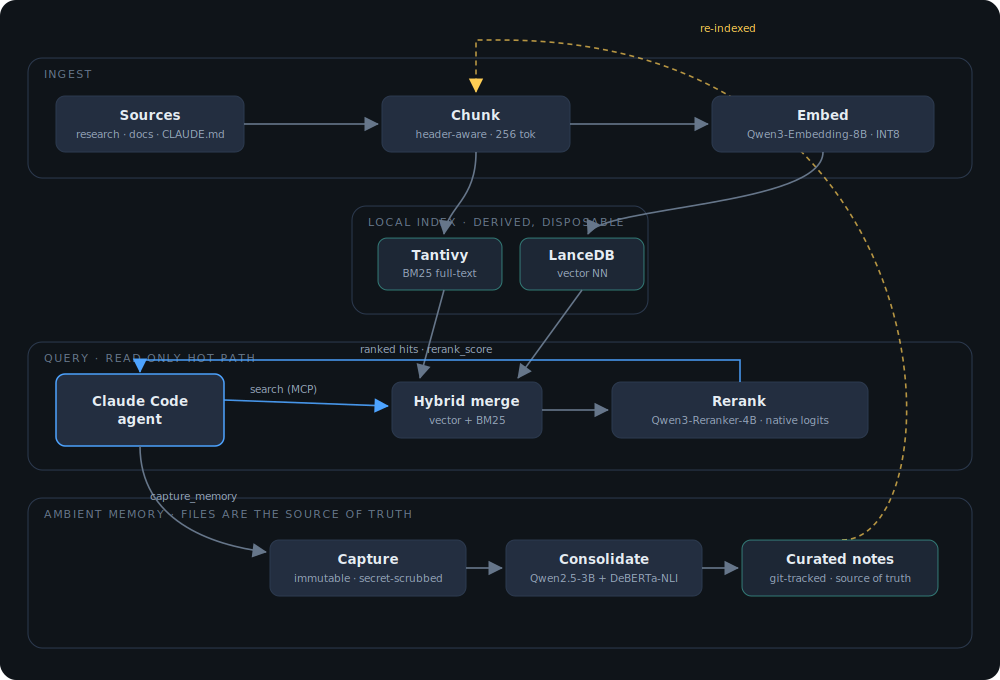

# mainframe-mcp

A **100% local, GPU-accelerated semantic knowledge base** for [Claude Code](https://claude.com/claude-code) and any other [MCP](https://modelcontextprotocol.io/)-compatible agent. It indexes the markdown knowledge scattered across your repos (`research/`, `docs/`, and root context files like `CLAUDE.md` / `AGENTS.md`), and gives coding agents high-precision hybrid search over it — plus an ambient memory pipeline that captures session knowledge and consolidates it into curated notes over time.

Everything runs on your own GPU. Nothing leaves your machine at query time.

## Architecture



*Three loops on one machine: ingest builds a disposable dual index; a read-only query path retrieves hybrid and reranks with the model's own logits; an ambient-memory loop consolidates immutable session captures into curated notes where newer facts win, then re-indexes them. Files are the source of truth; the vector index is derived and disposable.*

## What it does

- **Hybrid retrieval, reranked** — vector nearest-neighbor (Qwen3-Embedding-8B, INT8) + Tantivy full-text search, merged and re-scored by a cross-encoder reranker. Markdown-header-aware 256-token chunking, adaptive per-query-type instruct prefixes, section-heading injection at rerank time.
- **Native Qwen3-Reranker backend** — the reranker scores candidates via the model's yes/no logits with a task instruction (the model-card method), not a bolted-on classification head. On our eval this beat bge-reranker-v2-m3 by **+26% composite / +33% hit@1**.
- **Ambient memory (mem0-inspired)** — agents write immutable session-capture files (secret-scrubbed, gitignored lane); a consolidation pass merges them into curated, git-tracked memory notes where **newer facts supersede stale ones**, with NLI-backed contradiction surfacing and anti-bloat guardrails. Files are the source of truth — the vector index is derived and disposable.
- **Ops-hardened** — read-only search hot path, atomic manifest writes with crash recovery, index compaction + FTS refresh after ingest batches, poison-file-resilient syncs, path-traversal validation, and a layered secret-scrub denylist on every write path.
- **Measured, not vibed** — an eval harness with a regression gate (`eval/evaluate.py --min-score`), an experiment-log discipline (`eval/results.template.md`), and a GPU-free test suite (fakes + real LanceDB) that runs in CI.

## Requirements

- Python 3.10+ (developed on 3.14). **3.11–3.13 have the broadest binary-wheel coverage**; on very new interpreters some deps (lancedb, pydantic-core) may not have Linux wheels yet — pin to 3.13 there if `pip install` fails building from source.
- NVIDIA GPU with ~16 GB VRAM for the full stack (developed on an RTX 3090 24 GB); smaller presets in `configs/`
- PyTorch with CUDA — on Windows the default pip wheel is CPU-only:
  ```
  pip install torch --index-url https://download.pytorch.org/whl/cu128
  ```

## Install

```bash
pip install -e .            # core: lancedb, sentence-transformers, transformers, mcp, tantivy
pip install -e .[test]      # + pytest for the GPU-free suite
```

Configuration is optional — sensible defaults apply with no config file. To customize, copy `config.example.json` to `~/.claude/mainframe/config.json` (or start from a preset in `configs/`); most knobs hot-reload via the `reload_config` tool, model changes need a restart. Model weights download from Hugging Face on first run (~15 GB total for the full stack) and stay resident.

Register with Claude Code (use the interpreter of the environment you installed into — replace `python` with its full path if you use venvs/conda):

```bash
claude mcp add mainframe -- python -u -m mainframe_mcp.server
```

### Using with other MCP hosts

Nothing about the server is Claude-specific — it speaks plain MCP over stdio. Point any host at `python -u -m mainframe_mcp.server` and tune it with environment variables:

| Env var | Effect |
|---------|--------|
| `MAINFRAME_CONFIG` | Path to the config file (portable override; default `~/.claude/mainframe/config.json`) |
| `MAINFRAME_PREWARM=1` | Load models at startup instead of lazily on the first tool call. **Off by default** — an always-on gateway sharing a GPU should not claim ~13 GB of VRAM merely because a client connected. Set this for a dedicated, interactive setup that wants instant first-tool response. |
| `MAINFRAME_READ_ONLY=1` | Expose only `search` / `list_files` / `status` (no delete / consolidate / bulk-index / RAPTOR). Smaller tool schema, no accidental mutation — ideal when injecting Mainframe into ordinary conversations. Run maintenance from a separate, full-access invocation. |

Example (a generic gateway config; adjust to your host's schema):

```yaml
mcp_servers:
  mainframe:
    command: "python"
    args: ["-u", "-m", "mainframe_mcp.server"]
    env:
      MAINFRAME_CONFIG: "/path/to/mainframe/config.json"
      MAINFRAME_READ_ONLY: "1"      # recall-only in everyday chat
      # MAINFRAME_PREWARM: "1"      # opt in only for a dedicated instance
    timeout: 180
    connect_timeout: 60
```

## MCP tools

| Tool | Purpose |
|------|---------|
| `search` | Hybrid semantic+keyword search, reranked. Returns structured JSON (`{results, confidence, guidance}`); each result carries `rerank_score` (higher = better — the field to trust), char **and 1-based line** citation spans, and a truncation flag. |
| `capture_memory` | Write an immutable, secret-scrubbed session note under `<repo>/research/sessions/` and index it. |
| `consolidate_sessions` | Merge pending session captures into one curated `research/memory/` note (newer facts win), surface contradictions, archive the raw logs. |
| `sync_index` | Incremental sync: ingest new/modified knowledge files, prune deleted ones, compact the index. |
| `status` / `reload_config` | Health (models, VRAM, index compaction, pending captures) and hot config reload. |
| `ingest_file` / `delete_file` / `list_files` | The rest of the lifecycle. |
| `build_raptor` | Optional RAPTOR tier-1 summary clusters (off by default — hurts precision on our corpus). |

Query technique matters: **specific technical terms** (proper nouns, function names, exact config keys) rerank ~0.99; natural-language questions rerank ~0.05. See `docs/MAINFRAME_QUERY.md`.

## Model stack (default `configs/gpu-max.json`)

| Role | Model | VRAM |
|------|-------|------|
| Embedder | Qwen/Qwen3-Embedding-8B (INT8, 4096-dim) | ~9 GB |
| Reranker | Qwen/Qwen3-Reranker-4B (INT8, native logit scoring) | ~4.5 GB |
| Consolidator | Qwen/Qwen2.5-3B-Instruct (4-bit, lazy-loaded) | ~2.1 GB |
| Contradiction NLI | DeBERTa-v3-large-MNLI (lazy-loaded) | ~0.8 GB |

Swap any of them via config or env (`MAINFRAME_RERANKER_MODEL`, etc.). `BAAI/bge-reranker-v2-m3` remains a leaner, faster reranker fallback (~1.2 GB, ~3× lower search latency, lower quality).

## Privacy stance

- Serving is **fully local** — no network calls in the query or ingest path.
- Model weights download from Hugging Face on first run; that is the only default network activity.
- One **opt-in** exception: `contextual.enabled` sends document content to the Anthropic API at *ingest time only* (Anthropic's contextual-retrieval method, via Haiku with prompt caching). It is off by default and degrades to plain chunks on any failure.
- Session captures are secret-scrubbed (regex denylist: cloud keys, tokens, private keys, connection strings, env-style assignments) before touching disk, and the raw capture lane is designed to be gitignored.

## Development

```bash
python -m pytest tests/           # GPU-free suite (fakes + real LanceDB) — no GPU, no models, no network
python -u eval/evaluate.py --live # GPU eval against YOUR OWN live index (--min-score to gate)
```

The eval measures against your local corpus and GPU — **it cannot validate a PR by itself** (see the ground rules in [`eval/results.template.md`](eval/results.template.md)); retrieval-affecting changes get re-measured on the maintainer's corpus before merge.

Log every experiment in `eval/results.md` following `eval/results.template.md` — including the failures (on our corpus that graveyard includes RAPTOR-in-index, RRF fusion, doc-prefix embedding, seq-cls reranker conversions, and per-category instructions; retrieval leaderboards inverted against local measurement four separate times). Numbers are corpus-specific: treat the harness as the method and measure on your own corpus.

## Contributing

PRs from humans and coding agents are welcome — **read [CONTRIBUTING.md](CONTRIBUTING.md) first**: this repo's `main` is a force-pushed mirror snapshot, so PRs are applied as patches to the private development repo (with attribution) and ship in the next refresh rather than merging directly. Tests are GPU-free by design; retrieval-affecting changes get measured on the eval harness before landing.

## License

MIT — see [LICENSE](LICENSE).
