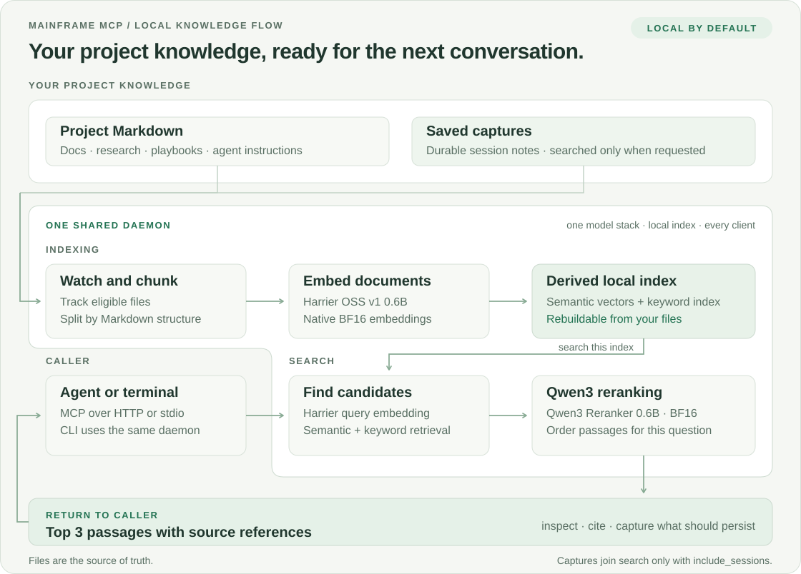

# Mainframe MCP

**Local knowledge for coding agents. Carry useful context across conversations.**

Mainframe makes your project's Markdown searchable across conversations. It finds relevant passages in documentation, research, and project instructions, returns source citations, and saves session notes for later recall. One local daemon serves your MCP clients and terminal, sharing a single model stack.

[Quick start](#quick-start) · [Connect your agent](#connect-your-agent) · [For agents](#for-agents) · [Configuration and operations](docs/V2.md)

## Why Mainframe

- **Find knowledge across projects.** Combine semantic and keyword search, then rerank passages for your question.
- **Follow the evidence.** Results identify the source file and section, with verified line citations when the file still matches.
- **Carry decisions forward.** Save an immutable session note and include it in future searches when you need that history.
- **Share the models.** Opening another client does not load another set of weights.

Your Markdown files remain the source of truth. The search index is a rebuildable cache. Retrieval runs locally; your calling agent decides how to use the evidence.

## Quick start

You need **Python 3.10+**, **Git** for installation, and an **NVIDIA GPU with BF16 support** for the default models. See [models and hardware](#models-and-hardware) for measured memory use.

### 1. Install

Use a dedicated Python environment with CUDA-enabled [PyTorch](https://pytorch.org/get-started/locally/). This example uses CUDA 12.8; choose a build supported by your system:

```sh
python -m pip install torch --index-url https://download.pytorch.org/whl/cu128
python -m pip install "git+https://github.com/sushiHex/mainframe-mcp.git@main"
```

<details>
<summary>Create a Python environment first</summary>

```sh
python -m venv .venv
```

Activate it with `.venv\Scripts\Activate.ps1` in PowerShell, or `source .venv/bin/activate` on Linux. Then run the installation commands above. Use this environment for the daemon and its clients.

</details>

These instructions install current `main`, where Harrier and the v2 daemon are the defaults. The original `v2.0.0a1` release download predates that change; see [migration and legacy v1](docs/PREVIEW_RELEASE.md).

### 2. Choose your projects

Create `~/.claude/mainframe/config.json`, including its parent directories:

```json
{
  "paths": {
    "repos_dir": "~/repos",
    "include_projects": ["example-project"]
  }
}
```

Replace `example-project` with a repository directory under your `repos_dir`. **An empty include list includes all eligible projects**, so start with an explicit selection.

Mainframe indexes root instruction files such as `CLAUDE.md` and `AGENTS.md`, plus eligible Markdown under `docs/`, `research/`, `machines/`, and `playbooks/`. Generated directories and routine files such as `README.md` are excluded.

### 3. Start and search

```sh
mainframe serve
```

Leave that terminal running. In another terminal using the same environment:

```sh
mainframe status
mainframe search "deployment checks and rollback steps" --detailed
```

First use downloads missing model weights from Hugging Face and indexes the selected files. Initial indexing can take time; `status` reports model and index progress. File watching and periodic rescans keep subsequent changes in sync.

## Connect your agent

Start the daemon separately. Every client should use the same configuration.

For **Claude Code**, register the stdio connection across your projects:

```sh
claude mcp add --scope user mainframe -- mainframe-mcp
```

For hosts that use an `mcpServers` configuration block:

```json
{
  "mcpServers": {
    "mainframe": {
      "command": "mainframe-mcp"
    }
  }
}
```

The command must be on the host's PATH. Alternatively, use the installed environment's Python executable with arguments `-u -m mainframe.adapters.mcp_stdio_shim`. This forwards requests without loading models in the client process.

**HTTP clients** can connect to `http://127.0.0.1:7433/mcp` using Streamable HTTP. Use `/mcp/ro` for search and status only. See [client setup](docs/V2.md#connect-clients) for configuration and authentication.

Once connected, ask your agent:

```text
Search Mainframe for the project's deployment procedure and cite the source.
Save the decision we just agreed on as a Mainframe note for example-project.
Find previous session notes about the deployment decision.
```

## Use from a terminal

```sh
mainframe search "deployment decision" --sessions --detailed
mainframe capture --file decision.md --project example-project --title "Deployment decision"
mainframe rescan
mainframe events --tail 20
mainframe down
```

Captures live in the configured state directory (`~/.claude/mainframe/captures/` by default) and are indexed asynchronously. Ordinary search excludes them; `--sessions` includes them. `down` finishes active work and stops the daemon to release its model memory. See the [daemon guide](docs/V2.md) for startup automation, diagnostics, and offline rebuilding.

## For agents

The default MCP endpoint exposes four tools:

| Tool | Use it to |
| --- | --- |
| `search` | Retrieve passages with `query` and `limit`. Add `include_sessions: true` for captures or `response_format: "detailed"` for excerpts and offsets. |
| `capture` | Save a useful note with `content`, `title`, and the intended `project`. |
| `status` | Inspect index readiness, model state, and configuration drift. |
| `maintain` | Request a rescan, optimization, or model reload. Rebuilding is an offline operation. |

**Search → inspect → cite → capture.** Use a focused question with concrete project terms. Read the source when the excerpt is truncated or the answer matters. A reranker score measures relevance, not factual correctness; reconcile conflicts and acknowledge missing evidence. Capture durable decisions and their rationale when the user wants them retained.

The [agent query guide](docs/MAINFRAME_QUERY.md) has exact request examples, response fields, and an instruction block you can adapt. Saving a capture is not an automatic consolidation step.

## How it works

<picture>
  <source media="(prefers-color-scheme: dark)" srcset="docs/architecture-dark.svg">
  <source media="(prefers-color-scheme: light)" srcset="docs/architecture.svg">
  
</picture>

Harrier embeds documents and queries. Keyword retrieval supplies exact-term matches alongside semantic candidates; Qwen reranks the combined results. Citations are checked against the source revision. Models load on demand and are shared across clients.

Reranking reads up to 2,048 tokens per prompt. Longer passages are truncated, with oversized inputs bounded before tokenization; see the [context limits and validation](docs/RERANKER_CONTEXT.md).

## Models and hardware

| Role | Default model | Precision |
| --- | --- | --- |
| Embedding | Microsoft Harrier OSS v1 0.6B | BF16, pinned native encoding |
| Reranking | Qwen3 Reranker 4B | INT8 |

Scoped measurements observed roughly **7–8 GiB peak CUDA allocation** for this stack. Allow additional headroom for reservation, larger inputs, and other GPU workloads. See [model comparisons](docs/MODEL_COMPARISON.md) and [reranker results](docs/RERANKER_CONTEXT.md) for methods and accepted ranking tradeoffs.

The daemon supports capture, indexing, and search. Consolidation, contradiction detection, and RAPTOR remain [legacy v1 features](docs/PREVIEW_RELEASE.md#capabilities). Changing embedding settings requires a matching index; follow the [offline rebuild procedure](docs/V2.md#index-ownership-and-recovery).

A model-only embedding override uses legacy Sentence Transformers encoding. To select another native embedder, configure its model, encoding, pinned revision, query prompt, and quantization together; see [model configuration](docs/V2.md#configure-and-start).

## Configuration and privacy

`MAINFRAME_CONFIG` selects a different JSON configuration file. Set it for both daemon and clients, and restart after editing configuration. The [configuration example](config.example.json) shows common settings.

- **Local by default.** Mainframe performs embedding, retrieval, and reranking on your machine. Weights download on first use. Your MCP host may send returned passages to its own model provider.
- **Optional remote enrichment.** Enabling `contextual.enabled` sends document content to the Anthropic API during ingestion. It is off by default.
- **Private captures.** Captures are secret-scrubbed before writing; review sensitive content before sharing it. Keep captures, configuration, and logs outside public Git.
- **Local access.** The daemon binds to loopback. Set `service.token` to require authentication; the CLI and stdio client read it from configuration, while HTTP clients supply a bearer header.

See [configuration and operations](docs/V2.md) for scope, authentication, model recovery, and live validation.

## Development

Work from a clone of this public repository:

```sh
python -m pip install -e ".[test]"
python -m pytest tests/ -q
```

Tests use fake models and temporary stores; they require no GPU or model downloads. CI also checks clean wheel installations on Windows and Linux. Read [CONTRIBUTING.md](CONTRIBUTING.md) and complete the [public push audit](docs/PUBLIC_AUDIT.md) before publishing. Retrieval changes need [measured evaluation](eval/README.md).

For live model comparisons on a shared GPU, follow the [paced evaluation workflow](eval/README.md#shared-desktop-gpu-runs). It spaces model forwards while monitoring resources and cancellation.

## License

[MIT](LICENSE).
